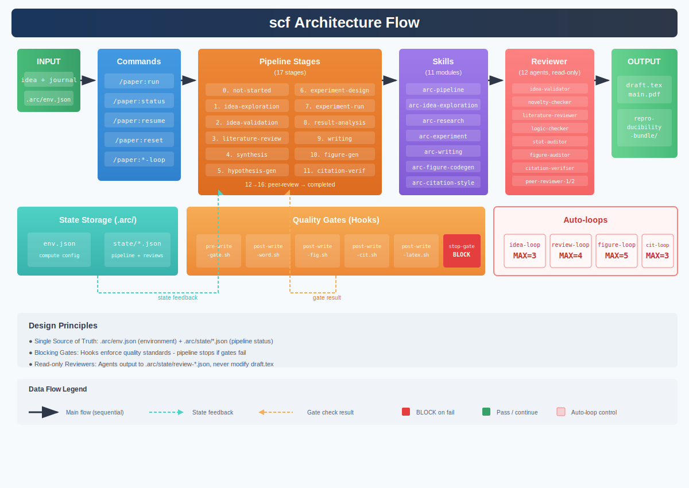

# scf Paper Framework

scf（Scientific Paper Framework）用于把研究 idea 推进为高质量、可验证、可复现的论文工程。

## 架构流程图

<p align="center">
  
</p>

## 核心设计原则

- **单一真相源**: `.arc/env.json` 存储环境配置，`.arc/state/*.json` 存储流水线状态
- **阻断式门控**: Hooks 强制执行质量标准，未通过则阻断流程
- **只读审查**: Reviewer agents 只输出审查结果到 state 文件，不直接修改论文
- **状态驱动**: 跨会话状态通过结构化 JSON 传递，不依赖模型记忆

## 验收口径

项目实现以 `PROJECT_SPEC.md` 为唯一核查标准。建议每轮迭代后执行逐章 PASS/FAIL/PARTIAL 核查。

## 快速安装

```bash
/path/to/scf/install.sh \
  --target /path/to/your-paper-project \
  --journal neurips \
  --project-name myproject
```

支持参数：
- `--target`
- `--journal`
- `--max-review-rounds`
- `--skip-env-probe`
- `--ssh-host`
- `--project-name`

## 完整运行示例

### 1. 初始化论文类型配置

```bash
cd /path/to/your-paper-project
claude
/paper:init --format long --domain ai-experimental --venue NeurIPS --pages 9
```

支持的参数：
- `--format`: `long` | `short` | `letter`
- `--domain`: `ai-experimental` | `ai-theoretical` | `physics` | `numerical`
- `--venue`: `NeurIPS` | `ICML` | `ICLR` | `ACL` | `AAAI` | `IEEE` | `Nature` | `PRL` | `custom`
- `--pages`: 页数限制（整数）

根据 `format` + `domain` 自动派生质量门控阈值（引用数、图表数、消融实验要求等）。

### 2. 查看状态

```bash
/paper:status
```

### 3. 运行完整流水线

```bash
/paper:run --idea "A robust low-resource reasoning method" --journal neurips --max-review-rounds 4
```

`/paper:run` 在开始前会读取 `.arc/env.json` 并断言 `compute.validated == true`，同时读取 `.arc/paper-type.json` 获取质量门控阈值。

## Auto-loop 命令

- `/paper:idea-loop`（MAX_ITER=3）
- `/paper:review-loop`（MAX_ITER=4）
- `/paper:figure-loop`（MAX_ITER=5）
- `/paper:citation-loop`（MAX_ITER=3）

终止与保护：
- 达到阈值提前终止；
- 达到 MAX_ITER 强制停止；
- review-loop 连续两轮分数下降时进入 `human-intervention-needed`。

## 质量标准

项目以 **PROJECT_SPEC.md §附录A（质量标准 v2.0 → scf 实现映射）** 为验收口径。核心质量门控：

- **引用**：数量按论文类型分层（长文≥30，短文≥15），近5年占比按领域分层（AI实验≥30%，AI理论≥15%），全部经四层 API 验证
- **图表**：矢量图优先，位图≥300 DPI；图数/表数按类型分层；每图须caption + 编号 + 对应源文件
- **统计**：所有定量结果报告均值±标准差；禁止 cherry-picking；消融实验按类型条件要求
- **学术诚信**：数据真实性可追溯，图表来自真实代码，COI 声明必须
- **页数**：按 `paper-type.page_limit` 门控，替代字数

完整验收链：`install.sh` → `validate.sh` → `/paper:init` → `/paper:run` → `/paper:export`。

详见 `docs/quality-standards.md` 和 `docs/paper-type-guide.md`。

## 环境配置（v4）

- 环境唯一真相：`.arc/env.json`
- 安装默认执行环境探测并生成 `.arc/env.json`
- `--skip-env-probe` 会复制模板，需手动填写后再验证

全量环境校验：

```bash
/path/to/scf/validate.sh --target /path/to/your-paper-project --full-env-check
```

## 验证

```bash
/path/to/scf/validate.sh --target /path/to/your-paper-project
```

## 卸载

```bash
/path/to/scf/uninstall.sh --target /path/to/your-paper-project
```
